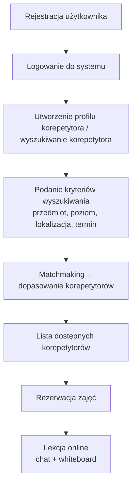

# Raport projektowy – Learnly

## 1. Opis działania systemu

Learnly jest aplikacją webową umożliwiającą kojarzenie klientów z korepetytorami oraz organizację korepetycji w środowisku online. System działa w architekturze klient–serwer i jest dostępny z poziomu przeglądarki internetowej.

Platforma obsługuje dwa typy użytkowników:

**Klient (uczeń)**  
- wyszukuje korepetytorów  
- przegląda profile nauczycieli  
- wybiera dostępny termin zajęć  
- rezerwuje lekcję  

**Korepetytor**  
- tworzy profil nauczyciela  
- określa przedmioty i poziomy nauczania  
- ustawia dostępne godziny prowadzenia zajęć  

Po wyszukaniu korepetytora klient może zarezerwować wybrany termin zajęć. W ustalonym czasie użytkownicy mogą przeprowadzić lekcję online z wykorzystaniem czatu oraz współdzielonej tablicy interaktywnej.

---

## 2. Schemat logiczny działania systemu



---

## 3. Wymagania funkcjonalne

System powinien umożliwiać:

- rejestrację użytkowników  
- logowanie do systemu  
- obsługę dwóch typów użytkowników (klient, korepetytor)  
- tworzenie i edycję profilu korepetytora  
- określenie nauczanych przedmiotów  
- określenie poziomu nauczania  
- dodawanie dostępnych terminów zajęć  
- wyszukiwanie korepetytorów według:
  - przedmiotu
  - poziomu nauczania
  - lokalizacji
  - dostępności czasowej
- rezerwację lekcji  
- prowadzenie czatu w czasie rzeczywistym  
- korzystanie z interaktywnej tablicy podczas lekcji  

---

## 4. Wymagania niefunkcjonalne

System powinien spełniać następujące wymagania niefunkcjonalne:

- dostępność systemu poprzez przeglądarkę internetową  
- responsywny interfejs użytkownika  
- stabilna komunikacja w czasie rzeczywistym  
- szybkie wyszukiwanie danych  
- skalowalność systemu  
- możliwość dalszej rozbudowy aplikacji  
- bezpieczne przechowywanie danych użytkowników  

---

## 5. Technologie i narzędzia

W projekcie zostaną wykorzystane następujące technologie:

### Frontend
- React.js  
- HTML  
- CSS  

### Backend
- C#  
- ASP.NET Core  

### Komunikacja w czasie rzeczywistym
- SignalR  

### Baza danych
- PostgreSQL  

### Narzędzia developerskie
- GitHub  
- GitHub Projects (zarządzanie zadaniami)  
- Visual Studio / Visual Studio Code  

---

## 6. Wymagania dotyczące bazy danych

System wykorzystuje relacyjną bazę danych **PostgreSQL**.

Baza danych będzie przechowywać informacje dotyczące:

- użytkowników  
- profili korepetytorów  
- przedmiotów nauczania  
- poziomów nauczania  
- dostępnych terminów zajęć  
- rezerwacji lekcji  
- wiadomości czatu  
- opinii użytkowników  

Struktura bazy danych będzie oparta na relacjach pomiędzy użytkownikami, korepetytorami oraz zajęciami.

---

## 7. Wymagania dotyczące bezpieczeństwa

W systemie zostaną zastosowane podstawowe mechanizmy bezpieczeństwa:

- szyfrowanie haseł użytkowników  
- uwierzytelnianie użytkowników  
- autoryzacja dostępu do funkcjonalności systemu  
- ochrona danych użytkowników przed nieautoryzowanym dostępem  
- zabezpieczenie komunikacji pomiędzy klientem a serwerem  

---

## 8. Architektura systemu
```mermaid
flowchart TD

A[React Frontend (Client)]
B[Backend API (ASP.NET Core)]
C[Authentication & User Management]
D[Matchmaking<br/>(wyszukiwanie korepetytorów)]
E[Booking System<br/>(rezerwacje zajęć)]
F[Realtime Communication Layer<br/>(SignalR)]
G[Chat]
H[Whiteboard]
I[(PostgreSQL Database)]

A -->|HTTP / WebSocket| B

B --> C
B --> D
B --> E
B --> F

F --> G
F --> H

B --> I
```


